# Micrio v3: The Road From JavaScript To WebAssembly &amp; WebGL using AssemblyScript
## From JavaScript (Canvas2D &amp; three.js/WebGL) to AssemblyScript + WebGL in 3 iterations

# Abstract

[WebAssembly](https://webassembly.org/) (Wasm) is the ability for your browser to run *compiled* code at (near-) native speeds. It is now recognised by the W3C as the [4th official web programming language](https://www.w3.org/2019/12/pressrelease-wasm-rec.html.en), after HTML, CSS and JavaScript.

[Micrio](https://micr.io) is a storytelling platform based around a high performance JavaScript library, allowing users to view and navigate ultra resolution images in a matter of milliseconds, as smoothly as possible. I created this platform and have been working on optimizing the client performance since 2015.

This article will be the epic tale of my discovery of WebAssembly, and the journey of migrating the current 2.9 Micrio version written in plain JavaScript to WebAssembly as much as possible.

# Terms used

In this article, some technical terms will be used. While I can't detail 100% of them, here is a summary of the most important ones:

* **JavaScript** (JS): A programming language that your browser understands. It powers most of the interactive web;

* **TypeScript**: A language built on top of JavaScript, to make the life of web developers easier;

* **WebGL**: [**WebGL**](https://en.wikipedia.org/wiki/WebGL) is a browser technology for being able to draw 3D graphics in your web browser. It uses the same underlying tech as a lot of 3D games use, directly utilizing your GPU instead of CPU;

* **three.js**: [**three.js**](https://threejs.org) is an open source JavaScript library, that gives developers a high level code API to create 3D graphics in JavaScript, using WebGL for rendering;

* **Canvas2D**: Next to WebGL, [**Canvas2D**](https://developer.mozilla.org/en-US/docs/Web/API/CanvasRenderingContext2D) is a browser drawing technique for drawing flat, 2D graphics;

* **Tiles**: A **tile** is a very small piece of a zoomable image used in [Micrio](https://micr.io). It is how Micrio works: it *streams* a very large image to the viewer's browser by looking at which parts of the main image the user is looking at, and only downloading and showing those. One of those parts is called a **tile**;

* **Array**: An **array** is nothing but a list of something, used in programming. In this article, all mentions of *arrays* are long, *very long* lists of numbers, like vector coordinates.

# Table of Contents

1. [**Introduction**](#1-introduction)

2. [**Current Situation**](#2-the-current-situation)

3. [**The Discovery**](#3-the-discovery)

4. [**First Rewrite: C++ and emscripten**](#4-first-rewrite-c-and-emscripten)

	1. [**First Results**](#41-first-results)

5. [**Second Rewrite: AssemblyScript**](#5-second-rewrite-assemblyscript)

	1. [**Going Atomic**](#51-going-atomic)

	2. [**Bundling the compiled Wasm inside the JS file**](#52-bundling-the-compiled-wasm-inside-the-js-file)

	3. [**The Realization**](#53-the-realization)

6. [**Third Rewrite: AssemblyScript &amp; WebGL**](#6-third-rewrite-assemblyscript-webgl)

	1. [**Directly connecting WebAssembly's Memory to WebGL**](#61-connecting-webassemblys-memory-to-webgl)

	2. [**Moving the image tile logic to AssemblyScript**](#62-moving-the-image-tile-logic-to-assemblyscript)

	3. [**Connecting it to JavaScript**](#63-connecting-it-to-javascript)

	4. [**Rendering the lot**](#64-rendering-the-lot)

7. [**Putting it to the test**](#7-putting-it-to-the-test)

	1. [**Benchmark till you drop**](#71-benchmark-till-you-drop)

	2. [**The testing process**](#72-the-testing-process)

	3. [**First results and subsequent runs**](#73-first-results-and-subsequent-runs)

	4. [**Quickest wins**](#74-quickest-wins)

	5. [**Wrong assumptions**](#75-wrong-assumptions)

	6. [**Be pedantic**](#76-be-pedantic)

	7. [**The final test results are in**](#77-the-final-test-results-are-in)

8. [**Going to production**](#8-going-to-production)

9. [**Conclusions**](#9-conclusions)

10. [**Afterthoughts and the future**](#10-afterthoughts-and-the-future-of-webassembly)

# 1. Introduction

Hi! I'm Marcel and I'm the creator of the [Micrio storytelling platform](https://micr.io) built around a high performance ultra high resolution image viewer, for both 2D and 360&deg; images, with added markers, tours, audio, and more.

As a hardcore vanilla JS dev, I started the Micrio JS client development back in 2015, pushing to find the best balance between hardware performance (60fps all the way), minimal CPU and bandwidth use (for older and mobile devices), and still deliver a sharp and high quality viewing experience.

[WebAssembly](https://webassembly.org/) (Wasm) is the ability for your browser to run *compiled* code at (near-) native speeds. It is now recognised by the W3C as the [4th official web programming language](https://www.w3.org/2019/12/pressrelease-wasm-rec.html.en), after HTML, CSS and JavaScript.

Basically, this means you can run compiled code written in a variety of programming languages (C/C++, Rust, Go, AssemblyScript, [and many more](https://github.com/appcypher/awesome-wasm-langs)) in your browser, without any need for plugins. In its purest form, you will need some JavaScript to get it running and to communicate with the browser. For instance if you want to have a graphical output such as a game, you will need to link your program to work with available renderers, such as WebGL.

This article describes my journey from upgrading the Micrio **JavaScript-only client to use WebAssembly**, with the hopes of improving performance, and taking my code to the next level.

# 2. The Current Situation

It has been my drive to keep optimizing Micrio since 2015. The latest stable JS of Micrio, [version 2.9](https://b.micr.io/micrio-2.9.min.js), is the result of over 4 years of streamlining, bugfixing, adding features, and keeping it all running as smooth as possible in the browser. 

For Micrio, it is **vital** that the performance on the client's browser is as good as possible. The reason for this is very simple: when you are being told a story, or watching a movie, even *a single frameskip* immediately takes you out of your experience.

Because Micrio is being used for an [ever growing list](https://micr.io/showases) of awesome projects, the most important thing is to make sure that for whoever visits a Micrio project, **it must work, and work well**.

So also keeping compatibility is hugely important: I don't want to show the user a "**your browser is not supported**" warning, while still keeping up with the latest tech. This balance is hard to find and having to keep compatibility with older tech is sometimes frustrating. Nonetheless, the library as a single JS file works on all semi-modern browsers, including even Internet Explorer 10 for 2D, and IE 11 for 360&deg; images.

The current tech stack of [version 2.9](https://b.micr.io/micrio-2.9.min.js):

* Source files are ES6 JavaScript modules
* This compiles (using the awesome [closure compiler](https://developers.google.com/closure/compiler)) to JavaScript ES5 so it works on older browsers
* Canvas2D rendering for 2D images
* three.js/WebGL rendering for 360&deg; images
* Using [CustomElements](https://developer.mozilla.org/en-US/docs/Web/API/Window/customElements) + polyfills for the `<micr-io>` tag
* Using [ShadowRoot](https://developer.mozilla.org/en-US/docs/Web/API/ShadowRoot) + polyfills

As you can imagine, displaying a [25.500 x 25.500 pixel](https://micr.io/i/ZDQxY/hubble-legacy-field-stsci-h-p1917a-f) in your browser in a matter of milliseconds, allowing the user to freely zoom in and navigate, requires a little bit of processing power.

Now, Micrio 2.9 *isn't bad*. It runs pretty smooth on all devices. But with WebAssembly around the corner, this could make a *big* difference in making Micrio's performance even better, and could improve the code architecture a lot.

And, perhaps, this could also mark the setup for a new major version, where I will draw a clear line and drop all compatibility and polyfills for older browsers: **Micrio 3.0**.

# 3. The Discovery

Already back in 2013, a [demo was released](https://www.youtube.com/watch?v=BV32Cs_CMqo) by the Mozilla team running Unreal Engine 3 in the Firefox browser at 60fps, using a port of the engine made ready for the web in only 4 days of work.

This was the first application I saw of [asm.js](https://en.wikipedia.org/wiki/Asm.js) -- allowing compiled code to run inside your browser at near-native speeds, using a super-optimized CPU-friendly subset of JavaScript. You could get this to work by compiling to [LLVM](https://en.wikipedia.org/wiki/LLVM)-compatible formats using for instance [emscripten](https://emscripten.org/) for C/C++-code. 

This was a definite game changer for the web and left me wanting to try it out myself for the longest time (*spoiler: 6 years*). It was also picked up brilliantly by the major browser engines, each in their own optimizing way.

Fast forward to March 2017. [WebAssembly is introduced](https://hacks.mozilla.org/2017/03/why-webassembly-is-faster-than-asm-js/) as an even more powerful way to run binary code in your browser. This joint effort by all major browsers (Firefox, Chrome, Safari and Internet Explorer) was focussed on bundling all separate efforts made so far by running compiled code inside the browser. I was blown away to realise that *all these browsers have worked together on this*, putting aside their differences.

Two years later in 2019, WebAssembly was recognised by the W3C as [the fourth official programming language for the web](https://www.w3.org/2019/12/pressrelease-wasm-rec.html.en). As soon as I realised there would be a [WebAssembly Summit at Google HQ early 2020](https://webassembly-summit.org/), I really, *really* wanted to go there to see what's up. I found a colleague at Q42 to join me and in February 2020 we found ourselves in Mountain View, surrounded by an awe-inspiring crowd.

That day was a real eye-opener on what WebAssembly can do, was already doing, and the amount of potential it still has to change how the web works. Not only for running compiled code in your browser, but **so much more** (briefly touched upon at the end of this post).

Watch the entire WebAssembly Summit 2020 on YouTube here:

.

# 4. First Rewrite: C++ and emscripten

Prior to the WebAssembly Summit, and to get to know the ecosystem, I finally followed up on my mental note from 2013 to play around with [emscripten](https://emscripten.org/). Basically you can take almost any project made in C or C++, and compile it to a binary `.wasm`-file, that your browser can natively run. 

At this point, I still didn't really have a clear image of where WebAssembly starts and stops, and how autonomously it could run inside your browser, so I started a new project from scratch to see if I could make a C++-implementation of the basic Micrio logic: a virtual *zoomable* and *pannable* image consisting of a lot of separate tiles, using a virtual camera for displaying only the tiles necessary for what the user is viewing inside your screen.

It turns out, emscripten already had great compatibility for [libsdl](https://www.libsdl.org/): a low-level audio, keyboard/mouse input, and OpenGL library. Which is awesome, because I could write my code using this very well documented library, even including mouse and key inputs and WebGL rendering. Since I was also working with downloading images, I also used the [stb_image.h](https://github.com/nothings/stb) image library.

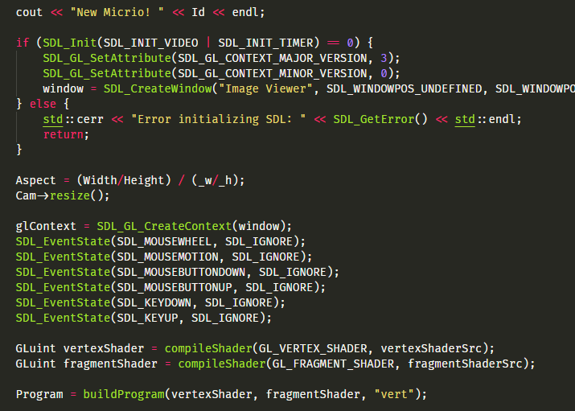

The largest struggle of this was picking up C++ again, never having used it outside of hobby scope many years ago. But after a few days of cursing and second guessing myself, I had a working first version with all of the most important features written with help of the SDL library:

* A virtual camera and all necessary viewing logic;
* Image tiles downloading;
* Rendering using WebGL(/OpenGL) using a simple shader;
* Mouse event handling for panning and zooming the image;
* Resize event handling to fit Micrio to the desired `<canvas>` HTML element

You can see this version running here: https://b.micr.io/_test/wasm/index.html :

[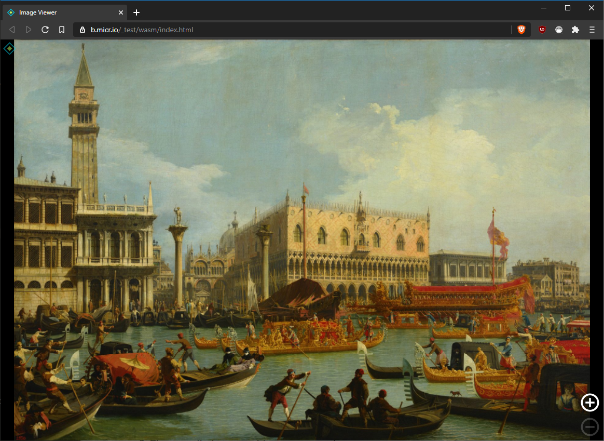](https://b.micr.io/_test/wasm/index.html)

## 4.1. First Results

As incredibly awesome it was to see Micrio in C++ running smoothly in my browser, and even handing all the user's input, there were a few reservations, which left me with an unsatisfied feeling.

### 1. Coding C++ felt old-fashioned
Writing C++ felt like going back in time. Incredibly powerful and fully proven, but also archaic, especially as a web developer. I spent more time fiddling with making an optimized `Makefile` than I care to admit.

")

### 2. The compiled `.wasm` binary was very large
As great as the help of `libsdl` and `stb_image.h` were to let me use OpenGL and JPG image functions, as much did they add to the final compiled binary file. Even with all `emcc` compiler optimizations (which can even use the awesome `closure` JS compiler), the resulting WebAssembly binary file was 760KB; compared to the JavaScript version of Micrio being around 240KB, this was a major setback. These libraries packed a lot of functionalities that were not necessary for Micrio, but were still included in the compiled version.

### 3. TIL: A *glue* file
This is the part where I learnt where the limits of WebAssembly start and finish. **WebAssembly is not a magical self-contained binary that lets you run full applications out of the box**. It actually needs to be *bound* to the browser using JavaScript.

Where I thought that all the SDL OpenGL code in C++ would automagically be recognised by the browser: *wrong*. What `emscripten` does, is to take all OpenGL operations from C++, and _converting them_ to WebGL operations your browser can understand.

Same with the `libsdl` mouse and keyboard-inputs: these were **glued** to the browser using an extra JavaScript file that would set event listeners for the specific cases, and send them to the WebAssembly binary. This separate JavaScript file was generated by the emscripten compiler, and had to be included in the HTML alongside the compiled binary `.wasm`-file.

Everything added together, the new total of the *base engine* of Micrio was a whopping **791KB**; a bit too much for my likes.

However, it's extremely neat that there is a C++ port of Micrio that would run natively on Linux and MacOS-systems. And I learned a lot from this.

# 5. Second Rewrite: AssemblyScript

Fast forward a few months, to just after the [WebAssembly Summit](https://webassembly-summit.org/) in Mountain View in February 2020. With a bundle of fresh energy and inspiration, I decided to see if I could use WebAssembly to improve the Micrio JavaScript client a second time.

During the WebAssembly conference, I was very impressed by a [synth demo](https://www.youtube.com/watch?v=C8j_ieOm4vE) written in **[AssemblyScript](https://www.assemblyscript.org/)**, a language created specifically for WebAssembly, using the TypeScript syntax. Basically you can write (near) TypeScript, which compiles to a `.wasm`-binary. So anyone familiar with either TypeScript or JavaScript ES6 will not have a lot of difficulties using it.

And the great thing-- it's all installed using `npm`, so getting it up and running and compiling your program is super easy!

There are a few basic [`types` added in AssemblyScript](https://www.assemblyscript.org/types.html), which are required for compile-time optimizations:

* `f64` / `f32` : For 64 or 32-bit floats;
* `i8` / `i16` / `i32` / `i64` : For signed `int`s, ranging in precision
* `u8` .. `u64` : For unsigned `int`s
* [And a few more](https://www.assemblyscript.org/types.html)

## 5.1. Going atomic

This time, I wanted to see if it was possible to only let a small part of Micrio run inside WebAssembly, and still use most of the JavaScript that was already inside the client. *How small can we get it?* I decided to focus on a subset of camera functions, such as translating screen coordinates to image coordinates and vice versa. So this time no rendering, event handling, or writing shaders.

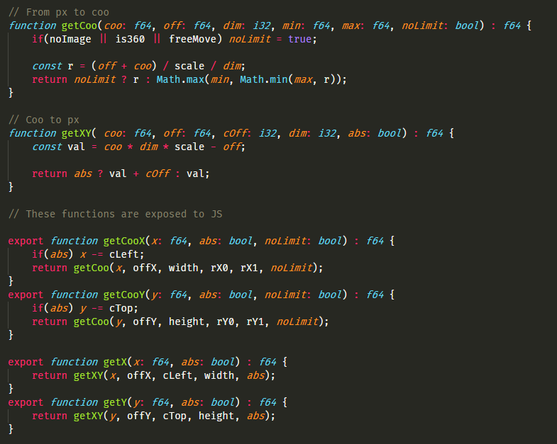
*Simple camera functions in AssemblyScript*

The result: a 3KB binary containing some basic math functions, that take an input and return an output. AssemblyScript offers you some *glue-tooling* by providing its own [Loader](https://www.assemblyscript.org/loader.html), which will deal with importing the binary file and being able to call them.

However, this is optional and I ended up using the JavaScript [WebAssembly API](https://developer.mozilla.org/en-US/docs/WebAssembly/Using_the_JavaScript_API), *neat*. And it turns out, this is super easy: simply use the `fetch` API to load your compiled `.wasm`-file, cast it as an `ArrayBuffer`, and use the `WebAssembly.instantiate()` function to get it up and running.

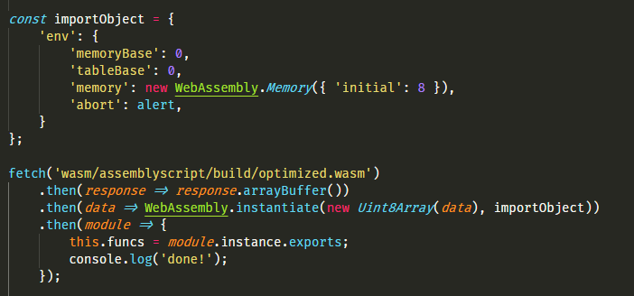

The compiled binary will then offer an `exports` object, containing the functions that you have exported in the AssemblyScript file, which you can immediately call from JavaScript as if they were normal functions.

Wait.. "*which you can immediately call from JavaScript as if they were normal functions*"...

**WebAssembly is running synchronously to JavaScript!** :exploding_head:

Having worked with WebWorkers before, I honestly thought that WebAssembly would run inside its own CPU thread, and that any function calls would be `async`. Nope, the Wasm-functions you call will return immediately!

[*This is, like, powerful stuff*!](https://www.assemblyscript.org/exports-and-imports.html#exports)

## 5.2. Bundling the compiled Wasm inside the JS file

Since I now had some extra performing hands on deck for Micrio that was very easy to integrate, I decided to include this minimal WebAssembly binary in the then-stable release of Micrio (2.9).

However, I didn't want an extra HTTP request for the Wasm binary every time someone loaded the Micrio JS. So I included a `base64` encoded version of the Wasm-file *inside* the Micrio JS, and for browsers that support it, auto-loaded that. As a fallback, I still had the original JS-only functions in place.

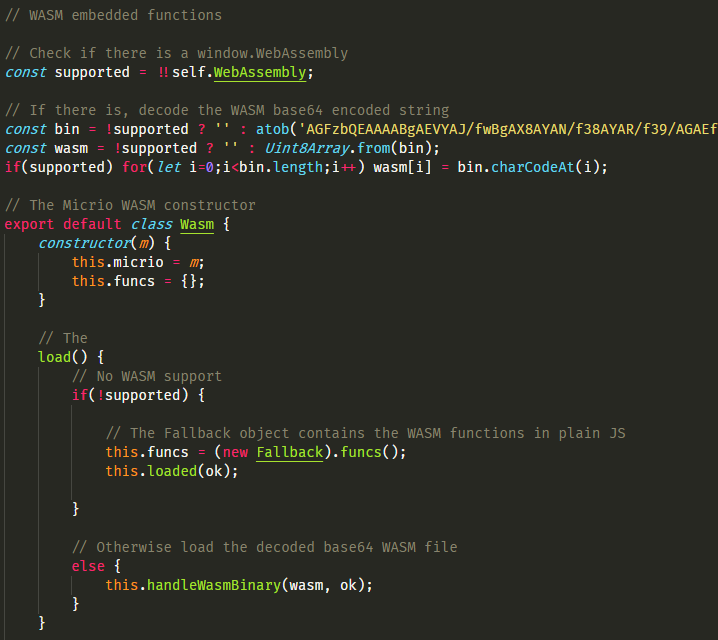
*Somehow this feels like cheating*

This approach worked wonderfully. Zero weird bugs and errors, and (marginal) better performance. The Micrio 2.9-release has been running Wasm for a while already!

## 5.3. The Realization

Okay, so, mission succeeded! The simplest math functions inside the Micrio JS were now handled by WebAssembly. But all rendering logic (Canvas2D for flat images and three.js/WebGL for 360&deg; images) was still 100% JavaScript.

This is a small summary of my though process for the weeks that followed:

> *Great.*
>
> *But there **has** to be more I can do with it*
>
> *Can I use it for HTML marker rendering? No -- direct DOM operations are not supported.*
>
> *Can I use it to download the image tiles for me with higher performance? No -- Wasm by itself has no download capabilities.*
>
> *Can I replace the current Micrio schizoid Canvas2D and three.js rendering methods using one solution?*
>
> *Hmm...* (this phase lasted about 2 weeks, going to bed and waking up with it)

Yes; yes I could! What if I created my own WebGL renderer, that supports both 2D and 360&deg;?

What is WebGL under the hood? To put it oversimplified: it takes a bunch of coordinate-arrays and textures and draws them on your screen using [shaders](https://en.wikipedia.org/wiki/Shader). These coordinate arrays would be single abstract representations of the zoomable images with its individual tiles.

**What if I moved the entire rendering logic to AssemblyScript?**

So kind of like the C++ emscripten implementation, but this time using the lean WebAssembly approach: only replacing parts of my JavaScript, maintaining Micrio's own event handlers and module (markers, tours, audio) logic.

# 6. Third Rewrite: AssemblyScript + WebGL

*Third time's a charm.*

This iteration, I used what I've learned in my previous two iterations:

1. **It's possible to have the entire rendering logic inside WebAssembly**
2. **It's possible to combine JS en WebAssembly fluently**

Back to the drawing board. What I was going to make was a single WebGL renderer, used for both the 2D and 360&deg; Micrio images, so I could do away with the Canvas2D and three.js implementations, not only (hopefully) improving performance, but being able to throw away *a lot* of JS code and do away with the three.js dependency.

## 6.1. Connecting WebAssembly's memory to WebGL

WebAssembly runs within its own sandbox, using its own requested amount of memory. For instance, a WebAssembly program can request 16MB of memory to work with. This memory is assigned by the browser, and can be fully used by your WebAssembly program.

As the developer, you are **100%** in control of this memory. Micrio is an excellent case where the amount of memory needed to handle the zoomable image logic can be precalculated. So it's entirely possible to have a WebAssembly program producing *zero* garbage memory; ie. runs without any external optimizations.

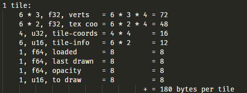

The cool thing is: this memory buffer is fully available from JavaScript as an `ArrayBuffer` object.

So.. if WebAssembly can create an array of vertices in 3D space, and JavaScript can have a *casted view* of those as a `Float32Array` (not cloned, simply a pointer to the shared memory space), these can be passed directly to WebGL, since WebGL accepts `Float32Array`s for its geometry and texture coordinate buffers!

That means that the output of WebAssembly is **directly connected** to WebGL's input by JavaScript *just once*, at initialization.

## 6.2. Moving the image tile logic to AssemblyScript

*Doing the hard work*

Now the basic setup was known, this is where it became more difficult. I had to *actually* take all the JS code for rendering 2D images using Canvas2D and 360&deg; images using three.js/WebGL (let's call this the *twin engine*), and rewrite it in AssemblyScript, using WebGL as graphical output.

This required a few steps, which I will not fully document here since it's out of scope (*next blogpost: WebGL?*). But the most important steps are below.

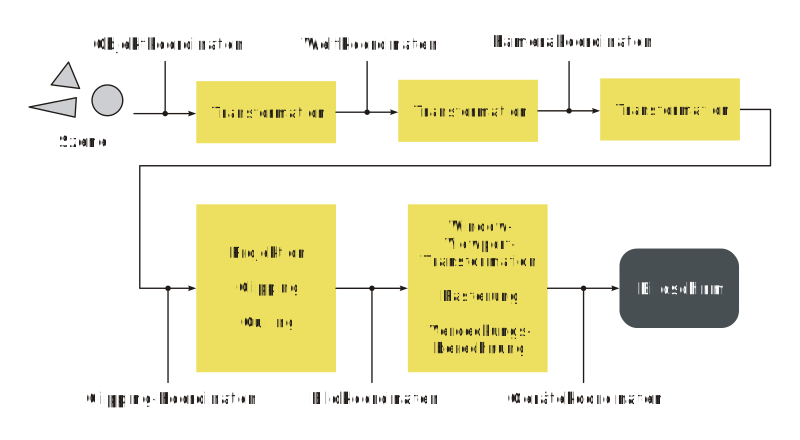*The German WebGL rendering pipeline -- you're welcome! ([wiki](https://commons.wikimedia.org/wiki/File:Graphics_pipeline_de.svg))*

The input for AssemblyScript are only the Micrio image parameters: a unique ID, the image width and height. The output must be WebGL-ready *vertex* and *texture coordinate* array buffers, containing all coordinates of all tiles and their individual texture mappings.

WebGL in its raw form gives you only low level functions to work with. Where drawing a tile in Canvas2D was simply using `context.drawImage(...)` with some relative coordinates, now all tile coordinates should be stored in a single vertex array buffer having static positions, which WebGL will draw relative to the virtual camera's 3D Matrix and the user's browser viewport.

It's our job now to create those array buffers from scratch. Since Micrio supports both 2D and 360&deg; images, and their technique is quite different, I had to create different array creation methods for both separately.

### 6.2.1. 2D images
The geometry of a 2D image is not that difficult. The image itself is a flat plane inside the 3D space, subdivided by all the tiles, one set per zoom level. All coordinates can be written as 2D coordinates, where `z` is always 0.

A single tile is simply defined as a flat 2D plane, with 6 vertex coordinates to specify the rectangle (your GPU thinks in *triangles*, so every rectangle consists of `2 * 3` vertex coordinates).

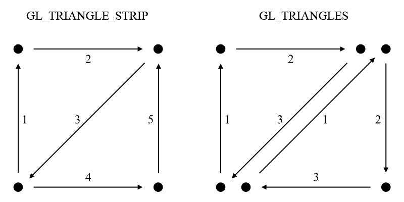

*Courtesy of [OpenGLBook.com](https://openglbook.com/chapter-2-vertices-and-shapes.html)*

### 6.2.2. 360&deg; images
For the 360&deg; images, this proved to be a larger challenge. Where three.js has added a super awesome higher level API where I was using `THREE.SphereBufferGeometry` to create the individual tiles inside the 360&deg; sphere, resulting in all geometry and texture mapping being taken care of, now I had to go back to middle school and refamiliarize myself with all `sin`, `cos` and `tan` math knowledge to manually do all the work that three.js had been doing for me before.

I really, really wish I paid better attention in school then.

Where 2D images are easy since they are, well, 2D, creating a 360&deg; sphere comes with a whole range of new complexities. An image tile cannot simply be a rectangle in 3d-space, because it would look very wonky for the tiles on a lower zoom level:

*Left is basic rectangle geometry, right is interpolated*

So it has to be broken up into multiple segments to make it look like a smooth part of a sphere inside WebGL. Instead of representing it as 6 vertex coordinates, this number is now `numberOfSegments * numberOfSegments * 2 * 3`, based on the zoom level of the tile to be drawn.

It all makes sense. But it took a long time before I got it right; not even mentioning the separate texture coordinate buffers here.

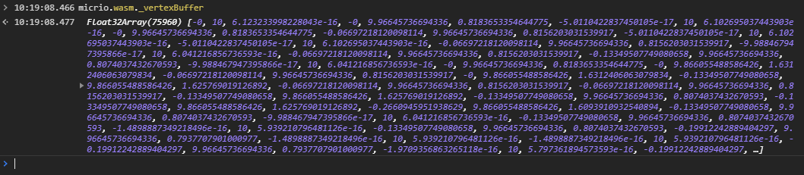
*The Float32Array vertex buffer generated by WebAssembly in the JS console*

In the end, both the 2D and 360&deg; images result in a single array buffer useable by WebGL, generated at runtime.

## 6.3. Connecting it to JavaScript

*`rm -rf js/camera`*

Since I was replacing modules inside the Micrio JavaScript client instead of working from scratch, I had to first remove all old JS-based rendering code (the *twin engine*), and then make the *glue* discussed earlier, linking the WebAssembly program as transparently as possible to the existing internal Micrio JS APIs.

Not only was this a fun thing to do, it was also a great sanity check of the entire Micrio JS architecture, seeing if there was rendering logic in places where it wasn't supposed to be.

After removing all last tidbits and placing the code full of `// TODO: FIX ME FOR WASM` comments, it was time to implement the newly created `Micrio.Wasm` JavaScript module, which exposed all of the previous render functions to the rest of the client, this time handled by WebAssembly.

This module acts as a 2-way street between JS and Wasm and takes care of a few things:

* Loading the Wasm binary and setting up the shared memory buffer;
* Acting as a transparent hub between JS modules and Wasm;
* Sending all required user events (mouse, key, touch) to Wasm;
* Downloading the requested tile images and linking them to WebGL as textures;
* Controlling the main rendering loop for both Wasm and JS (for correctly placing/animating HTML elements like image markers).

Bit by bit, over the course of a few weeks, this engine was made as a perfect fit to work together with the rest of the JS client, saving some hardly used and exotic implementations (but still used by 1% of the Micrio projects) for last.

## 6.4. Rendering the lot

This is what's so cool about WebGL: you can tell it to render certain *parts* of your pregenerated geometry buffer. All you need is to know the individual tiles' buffer start index, and the number of coordinates the tile uses in 3d space, and those are the only parameters to pass to WebGL to draw this tile (alongside the correct texture reference-- disregarded here).

The functions to decide what those tiles are, are quite different between 2D and 360&deg; images, the latter using a lot of 3D Matrix calculations, of which I will spare you the details here.

So now we are at the point where everything is in place to draw a frame in Micrio. To do this, AssemblyScript needs to know:

* The dimensions of your browser window, which it gets from JavaScript
* How the virtual camera is positioned and zoomed in, based on all prior user input received from JS

And then returns a bunch of `start` and `length` indices to WebGL, to draw the tiles:

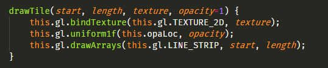

This JavaScript function, the actual WebGL rendering function, is called from *inside* AssemblyScript. Yes, [it is totally possible to call JavaScript-functions from inside your running WebAssembly functions](https://www.assemblyscript.org/exports-and-imports.html#imports)!

This makes JavaScript a mere **puppet** of WebAssembly. Which is friggin' awesome.

After all said and done, and not quite as straightforward as described here (360&deg; only came after the 2D renderer was finished), I was left with a Micrio client that was good enough to start testing and benchmarking with!

# 7. Putting it to the test

So, after the entire ordeal of the previous chapter, we are now left with a *testable* Micrio JS/Wasm/WebGL client. Not yet ready for production, but slowly going from first steps to the full performance potential.

The new client already *felt* a lot smoother in my browser. Zooming, panning and animating clearly went more smooth than the previous JS-only version.

This was also not a very big surprise, just looking at the difference in uncompiled code of both versions:

* Micrio 2.9 has a total of **444KB** JavaScript code
* Micrio 3.0 now has 315KB JavaScript and 56KB AssemblyScript, totalling **371KB** of code

That means that I had **73KB** less Micrio-code after the migration, for exactly the same behavior! Where did that all go!?

Not to mention that for 360&deg; images, I could now do away with the three.js dependency, which was an extra **607KB** of JavaScript.

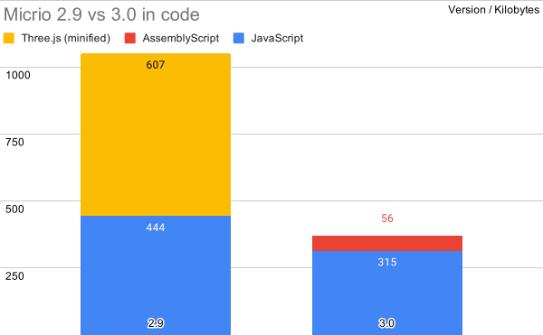

*I still feel smug about this.*

In the next chapter ([Going to production](#8-going-to-production)) I will write more about making the new library as compact as possible.

But first, I want to *prove* that the last few months were not spent in vain, and actually have some measurable results of the differences between Micrio 2.9 and 3.0.

## 7.1. Benchmark till you drop

*Disclaimer*: Software testing and benchmarking is an art form to which there is no end of detail. Where a professional tester would take an actual Windows 3.1 PC to see how Micrio would perform on there, I have been a little more lazy in my approach.

As I mostly wanted to test the *difference* between the performance of Micrio 2.9 and 3.0, I decided that a **single-device** (my medium-end Windows laptop), **single-browser** (Chrome) benchmark run would be sufficient.

The Chrome devtools have great benchmarking tools, which I used. To be sure that there was as little background noise as possible, I ran all tests after a fresh reboot, making sure no unnecessary background processes, such as Windows Update, were running.

The test itself was taking [this hi-res Micrio image](https://micr.io/i/dzzLm/the-fight-between-carnival-and-lent-pieter-bruegel-the-elder "The Fight Between Carnival and Lent by Pieter Bruegel the Elder"), removing all HTML-related rendering modules such as the markers, so we're left with just the image renderer, and running the **Benchmark** video tour, which is a 2-minute animated camera path through the image.

All tests were run with the browser in fullscreen mode, on a 1440p screen (2560 x 1440px).

**If you want to try it yourself, try the tour in both versions: [Micrio 3.0](https://micr.io/i/dzzLm/) vs [Micrio 2.9](https://micr.io/i/dzzLm/the-fight-between-carnival-and-lent-pieter-bruegel-the-elder?v=2.9)** (open *Video Tours* from the menu and select *Benchmark*).

## 7.2. The testing process

Before we go to the results, these are some general things I've learned in the bencharking and subsequent optimization process.

**Tip 1: if you can, make the benchmark as quick and meaningful as possible**

Since I was using my work laptop for benchmarking, and I made the benchmark test tour *2 whole minutes long* (which is too *short* to leave it running and come back later, but too *long* to wait it out), especially since I wasn't multitasking during the benchmarks, I *really* wished I made the benchmark at least 50% shorter. But since I already had a lot of results when I realised this, I didn't want to blemish them by changing the tour halfway, or by redoing them all.

So I stuck with the 2:00 tour. I can still dream every frame.

**Tip 2: use a private browser window without any extensions running**

Also doing some benchmarking on another browser running Chromium (Brave), I realised some numbers were *way* off from Chrome's results. After research, this had to do with some Chrome extensions running that were definitely influencing the performance.

**Tip 3: for your sanity's sake, do a baseline test every once in a while**

To be sure, and because you never know the state of the testing machine, every few tests do a baseline test to see if the results were still the same as before. In this way, you can make sure that there are no external factors tainting the test scores. Because results will never be 100% the same, you need to know those margins to know when any change you make is significant.

**Tip 4: don't do bulk changes between benchmarks**

Sometimes after a benchmark, I would change several small things at once, and then run the benchmark again to see if I *fixed it*.

After *a lot* of trial runs, I found out that this was not a smart thing to do. Some subtle settings (like turning alpha transparency on or off for WebGL) might be a single `true` to `false` setting, but could a have major performance impact. And without testing that setting individually, *you just don't know that*. It might feel too menial, but it's really worth it.

## 7.3. First results and subsequent runs

First of all, the benchmarks were *not only* testing the JavaScript vs WebAssembly performance. A lot more had changed under the hood, for instance going from Canvas2D rendering to WebGL. These tests are by no means good comparisons for barebone JS versus Wasm, but rather performance of Micrio as a whole.

After the first few trial runs, while the test *looked* much smoother on my screen using Micrio 3.0, the measured results were not that impressive. Over the 2 minute measured timespan, there was only *14% less* CPU usage than with 2.9, tested over a number of trials.

*Meh.*

There seemed to be overall less scripting, but *way* more rendering and painting going on. Also, the red dots in the timeline at the top indicate blocked frames, or frame skips. There were actually *more* than before now.

After a long sigh, this result yielded a week's worth of code optimizations, tweaking, and small rewrites, to see if I could get more out of it than this.

## 7.4. Quickest wins

So, what did I really change in those optimizations? And more interestingly: *could I do the same optimizations to 2.9 and get the same results*?

Well, for sure up to a certain level. For instance, the entire tile image download logic was also rewritten, where code from 2018 was replaced with code from 2020. I think that might also have a positive impact on 2.9. However, most optimizations really had a lot to do with tweaking the WebGL rendering pipeline, the frame drawing logic (which was drastically different in 3.0), and more small things.

Plus, the entire code architecture had just changed. Where before, it might not be easy to make a single change that would impact both the 2D and 360&deg; rendering pipeline, now all rendering used a single pipeline, making optimizing it so much easier and nice to do.

Perhaps the most important thing I did to optimize things, was to examine the benchmarking test results: 

1. *Which step is taking too much time, and how can we minimize that?*
2. Backtracking that code until it worked better: turning off individual functions until it barely works, until the performance is acceptable;
3. Finding the next thing to optimize, and `GOTO 1` *ad nauseam*.

Keep measuring every step so you gain a better understanding of what's *actually* happening inside your browser.

This is by far the best way to optimize code. However, the next part details some other things that *I thought* would improve performance, but in fact didn't.

## 7.5. Wrong assumptions

> "I know what's good for my computer!" -- *me*

Okay. The Micrio blooper reel. What did I do horribly wrong, and why did I do that?

### Don't use `WebWorkers` for simple download tasks
A lot of Micrio involves downloading *a lot* of individual tile-textures when the user is panning and zooming the large images. [WebWorkers](https://developer.mozilla.org/en-US/docs/Web/API/Web_Workers_API/Using_web_workers) are asynchronously running separate CPU thread you can call from your main JS thread, which you can give a task to do on its own.

I thought it would be a good idea to offload the texture loading to 3 separate WebWorkers. On paper this is a good idea: the downloading and casting to `ImageBitmap` can be done in the WebWorker, and when it's done, it just passes the bitmap back to the main JS thread, so it can be linked as a WebGL texture.

After using this for a while, I found out that this was actually a large performance stopper. I haven't fully dived into it, but I do know this:

**I assumed I knew what was good for the browser.**

What I forgot is that the browser engine is *heavily* optimized by itself, and by using the WebWorkers, I solved a problem before it became a problem. The browser on itself is optimized enough to simply download all the images in the main JS thread.

### Don't use `requestIdleCallback` for semi-crucial things
On paper, [`requestIdleCallback`](https://developer.mozilla.org/en-US/docs/Web/API/Window/requestIdleCallback) is a great function: like `requestAnimationFrame` firing *the next available drawable frame* that's good with your browser, `requestIdleCallback` fires when *your browser isn't doing anything*. Meaning, you can do background cleanup functions, or functions that would otherwise block the current rendering thread.

First, I used it to cast downloaded textures to WebGL textures; usually, this takes a *little* CPU time, so I wanted to do that when nothing else was going on at the moment, to prevent blocking any rendering.

Turns out, on mobile phones, while you are using touch events, **no single** `requestIdleCallback` function will be fired. So when I was pinching on a touch device, the Micrio image would not get sharper: the tile texture image was downloaded, but was not cast to a WebGL texture until *after I stopped pinching*.

That was a nice one to find out, since otherwise it seemed to be working quite well.

### Take best practises seriously
*Note*: Until writing this article I thought this was common knowledge, but I couldn't find any source to back me up. It *is* a best practice however!

In a `requestAnimationFrame`-loop, put your next frame request (the next `requestAnimationFrame` call) *as early as possible* in your rendering function. The reason for this is that if your actual drawing and rendering will take longer than than a few milliseconds, the next frame request might be called too late for your browser to still give it space to actually give it the next frame!

This is what caused earlier Micrio versions a lot of janks and frameskips. The steps in the render functions were:

1. Update all positions and draw everything on the screen;
2. Check if I need to request another frame (based on whether all required tiles are loaded, or there is a camera animation running);
3. If a new frame is required, request one and `GOTO 1`.

This makes total sense-- you don't want to have an ever-running animation loop when there's no updates to draw. But also, you don't want to do the *actual drawing on your screen* before requesting your next frame, since that takes a few valuable milliseconds extra.

So in WebAssembly, I made a `.shouldRequest()` function, which firstly did the pre-work required for the rendering, returning a `true` or `false` for whether JavaScript should ask for a next frame or not.

After *that*, all the real drawing was done.

This fix didn't change CPU usage a lot, but it *did* remove almost all of the skipped frames.

### General point

> "Don't think too much!" -- *my old German teacher*

Your browser is already the result of 25+ years of the biggest minds on the web working together. It's now 2020, and you can place a lot more trust into its inner workings than, say, 10 years ago. Some of my performance problems were due to my overthinking, and the resulting *overengineering*.

**Tip 5: Only fix problems that are real problems; don't waste your time by making assumptions that will fix a non-problem.**

## 7.6. Be pedantic

*Todo*

## 7.7. The final test results are in

After the optimizations, of which none could be singled out to be *the thing that fixed it all*, the numbers were looking quite differently:

Or for a better comparison:

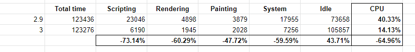

:tada: **65% less CPU used than in 2.9!** :metal:

Above that, all frameskips were gone, and there was less memory used. These results were also the same over multiple runs.

This proved to me that the whole operation was worth it. I was ecstatic, and tired of the early mornings and nights that the optimizing took me.

# 8. Going to production

Now that we have our new Micrio running great in the garage, we need to make it street worthy.

There are a few important constraints for the production version of the Micrio JS file:

* It needs to be **a single download**: The downloaded JS file should be the *entire runtime*; there shouldn't be an extra HTTP request for the Wasm binary. This would be a lot more hassle for developers, as it immediately loses its stand-alone properties;

* It needs to be **light weight**: Micrio is a JS library often included in external web projects, and should not affect any download times;

* It needs to **load and work on *all* browsers**: It cannot be the responsibility of the developer to do browser detection and Micrio version selection based on that.

## 8.1. Keeping it a single download

Older Micrio versions required the developer to include 2 files, the Micrio JavaScript and CSS (for the default layout, markers, popups, etc), seperately. I never really liked that, since both had their own version number (ie. `micrio-1.9.min.js` and `micrio-1.9.min.css`), and were both a separate HTTP request.

So for version 2.0, I embedded the CSS into the JS, making it one single package containing everything it needs. This worked great.

I wanted to do the same with the Wasm binary to prevent any second HTTP request and the extra disadvantage that Micrio could not work independently without an internet connection.

So, [like before](#52-bundling-the-compiled-wasm-inside-the-js-file), I took the compiled `.wasm` file of 32KB, made it a `base64` string, and included that inside the JS file. It did blow the Wasm up to **42KB** as an ASCII string, but worked great.

## 8.2. Keeping it light weight

Since our current version uses Wasm, and since all browsers that support that [also support native ES6 JavaScript](https://caniuse.com/#search=es6) (or ECMAScript 6, the latest version of JavaScript), I knew that *for the browsers able to run this Micrio version*, I didn't have to compile the JS to ES5 anymore.

That means that the [closure compiled](https://developers.google.com/closure/compiler) JS code could use arrow functions, native promises, and much more. Resulting in a much smaller compiled codebase: turning 315KB of JS code into **170KB** of minified JavaScript.

Adding to that our 42KB of base64-encoded Wasm binary, we are left with a bundled, fully working, ES6 executable Micrio JS of **212KB**.

Putting that next to the 2.9 compiled JS of 250KB, that's ([*again*](#73-first-results-and-subsequent-runs)) about a 15% decrease of filesize. Also, since the hosted Micrio JS is delivered using `gzip` compression, the resulting download sizes were also improved: **73KB** for Micrio 3.0 vs **84KB** vs 2.9!

## 8.3. Keeping it compatible

This is where it gets interesting.

Since one of my requirements is that the newly created Micrio 3.0 library can run in **any** (previously compatible) browser, this means that even *Internet Eplorer 10* should be able to run the JS.

Which (and I really tried), *it didn't*.

This could simply be resolved including a browser warning for older, non-compatible browsers. Or, instructing that developers using Micrio in their projects should stick to the 2.9 version.

Which neither I wanted to do:

* Micrio projects are often aimed at broad audiences and should be *all inclusive*-- even your grandparents still using Internet Explorer 10 should be able to enjoy the projects;

* By telling developers to stick to 2.9 for older browsers, the adoption of 3.0 would take forever.

### Backwards compatibility

So, I wanted to make Micrio 3.0 be executable on *all* browsers. Of course version 3.0 would never run in Internet Explorer 10. So I needed to think of a way of **auto-switching to Micrio 2.9** in the case of incompatible browsers!

Which is not that hard. All I needed was:

* A detection whether this browser is compatible (`if(!window.WebAssembly) { .. }`);
* A way to replace the 3.0 `<script>` tag with the 2.9 version, done *while executing* the main 3.0 JS.

Done in a few lines of code, this works wonderfully!

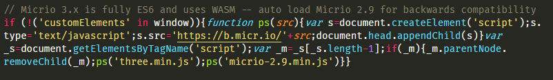

### But... ES6

When putting everything together (the ES6-compiled JavaScript, the Wasm base64 and the compatibility loader), **Internet Explorer refused to run the file**.

Because it had unknown JavaScript syntax (ES6) in it further on, it refused to parse the file as a whole and wouldn't even execute the simple backwards compatibility trick at the top.

This was kind of a big deal. Because this meant that I would have to go back to ES5-compiled JS for 3.0, only for Internet Explorer being able to run 4 simple lines of JavaScript.

Bummer!

### Hackity-hack

..*Did I mention before that I base64-encoded the Wasm binary, so I could bundle it inside the main JS file?*

Instead of giving in to having to compile the brand new and shiny Micrio code to ES5, I decided to **take the ES6-compiled code, base64 encode that *too*, and put *that* in the Micrio JS bundle**, so there wouldn't be any ES6 syntax inside the JS directly.

* **Yes**, it's super ugly.
* **Yes**, it's not developer-friendly.
* **Yes**, it made the file size larger by a lot.

But most importantly, *it worked*! For Internet Explorer, the 4 lines of code to switch the 3.0 JS to 2.9 would run, and for all others, the ES6 code was decoded, and run using `new Function({the decoded ES6 inside a function string})`.

Problem solved! We now had a very ugly bundled JS file that would run Micrio 3.0 perfectly, and automatically switch to Micrio 2.9 for older browsers!

### But... file size :(

One disadvantage of `base64`-ing all compiled ES6-JS code (170KB), was that it resulted in a **226KB** blob. Adding the Wasm base64, we were left with **268KB** of JS-- or 100KB gzipped.

Which was a 20% increase over Micrio 2.9.

Not dramatic, but I *still* felt unsatisfied, since the smaller filesize advantage was gone due to *Internet Explorer*.

I would not let it defeat me!

### Hackity-hack ^ 2

What I found, was that `gzip` does not work that well with base64-encoded strings. It compresses it, but not as much as the pre-encoded code. This was for both the Wasm binary, and the ES6 code.

If only I could gzip them **before** base64-encoding them..

Long story short: *I did*.

The bundling process for the Micrio JS now looks like this:

* Take the compiled Wasm binary, gzip it (32KB -> **17KB**), and base64-encode it
* Take the closure-compiled JS, gzip it (170KB -> **55KB**), and base64-encode it
* Add the ES5 backwards compatibility loader

The only thing required now was that I should be able to decompress the decoded gzipped blobs *inside the browser*. Unfortunately there is no JS API for this, but [zlib.js](https://github.com/imaya/zlib.js), a minimal footprint JS gzipping library, does the job perfectly.

Leaving me with a neat JS file:

* The ES5 backwards compatibility loader
* The zlib.js include (12KB)
* The gzipped+base64'd Wasm binary
* The gzipped+base64'd JavaScript

Totalling... **101KB**, or **60%** smaller than the 2.9 JS bundle (250KB)! :tada:

Or, gzipped, **74KB**, which was still a **12%** profit over 2.9.

I could now finally sleep peacefully.

# 9. Conclusions

*And that*, children, is how I ended up with the weird-looking, but greatly working [micrio-3.0.min.js](https://b.micr.io/micrio-3.0.min.js)!

# 10. Afterthoughts and the future of WebAssembly
