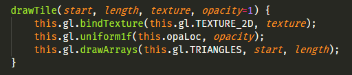

# Micrio v3: The Road From JavaScript To WebAssembly &amp; WebGL using AssemblyScript
## From JavaScript to AssemblyScript in 3 iterations

# Abstract

WebAssembly (WASM) is the ability for your browser to run *compiled* code at (near-) native speeds. It is now recognised by the W3C as the [4th official web programming language](https://www.w3.org/2019/12/pressrelease-wasm-rec.html.en), after HTML, CSS and JavaScript.

Micrio is [...]

# Table of Contents

1. **[Introduction](#1-introduction)**:
What is Micrio, what is this article about, setting constraints: client side app migrating from JS to AssemblyScript//WebAssembly.

	1. **[Terms used](#11-terms-used)**:
	Terms used throughout this article

2. **[Current Situation](#2-the-current-situation)**:
Micrio 2.9, short history, techstack, browser compatibility.

3. **[The Discovery](#3-the-discovery)**:
Asm.js old demos, WASM summit at Google Feb 2020

4. **[The Rewrite: C++ and emscripten](#4-the-rewrite-c-and-emscripten)**:
From JS to C++

	1. **[First Results](#41-first-results)**:
	How C++ was not the perfect choice

5. **[The Rewrite: AssemblyScript](#5-the-rewrite-assemblyscript)**:
The initial application of AssemblyScript WASM to Micrio 2.9

	1. **[AssemblyScript](#51-assemblyscript)**:
	AssemblyScript basics
	2. **[Going Atomic](#52-going-atomic)**:
	Rewriting just a tiny part of JS
	3. **[Bundling the compiled WASM inside the JS file](#53-bundling-the-compiled-wasm-inside-the-js-file)**:
	Keeping the resulting binary in the same JS file
	4. **[The Realization](#54-the-realization)**:
	Thinking about the next steps

6. **[The Rewrite: AssemblyScript &amp; WebGL](#6-the-rewrite-assemblyscript-webgl)**:
4 months of back to the drawing board -- back to basics with WebGL and manually created memory buffers

	1. **[Directly connecting WebAssembly's Memory to WebGL](#61-connecting-webassemblys-memory-to-webgl)**:
	Taking JS out of the equasion

	2. **[Doing the hard work](#62-doing-the-hard-work)**:
	Back to square zero

		1. **[Abstracting the tile logic](#621-abstracting-the-image-tile-logic)**
		2. **[2D images](#622-2d-images)**
		3. **[360&deg; images](#623-360-images)**
		4. **[Rendering the required tiles](#624-rendering-the-required-tiles)**

7. **The Benchmark**:
What and how to measure, what to improve

8. **The Rewrite: Optimizing everything**:
Putting everything together in a single JS file, making it work on all browsers, reducing clutter and last minute code optimizations

9. **The Satisfaction**:
Finishing touches and real world results

10. **Conclusions**:
The result: pros and cons. When (not) to use WASM, best practices, thoughts on the future.

11. **Afterthoughts and the future**:
Compiling for the web, server microservices using WASM, freedom of choice of programming language, and how it will really change the landscape of technology, the fabric of our world, and might be the ultimate answer of life, the universe, and everything.

# 1. Introduction

WebAssembly (WASM) is the ability for your browser to run *compiled* code at (near-) native speeds. It is now recognised by the W3C as the [4th official web programming language](https://www.w3.org/2019/12/pressrelease-wasm-rec.html.en), after HTML, CSS and JavaScript.

Basically, this means you can run compiled code written in a variety of programming languages (`C/C++`, `Rust`, `Go`, `AssemblyScript`, [..](https://github.com/appcypher/awesome-wasm-langs "and many many more")) in your browser, without any need for plugins. In its purest form, you will need some JavaScript to get it running and to communicate with the browser. For instance if you want to have a graphical output such as a game, you will need to link your program to work with available renderers, such as WebGL.

This section will be the tale of my discovery of WebAssembly, and the journey to migrating the 2.9 Micrio version written in plain JavaScript to WebAssembly as much as possible.

## 1.1. Terms used

In this post, a lot of technical terms will be used. While I can't detail 100% of them, here is a list of the most important terms to understand:

* **Tiles**: A **tile** is a very small piece of a zoomable image used in [Micrio](https://micr.io). It is how Micrio works: it *streams* a very large image to the viewer's browser by looking at which parts of the main image the user is looking at, and only downloading and showing those. One of those parts is called a **tile**;

* **JavaScript** (JS): A programming language that your browser understands. It powers most of the interactive web;

* **TypeScript**: A language built on top of JavaScript, to make the life of web developers easier;

* **WebGL**: [**WebGL**](https://en.wikipedia.org/wiki/WebGL) is a browser technology for being able to draw 3D graphics in your web browser. It has a very high performance, since it uses the same underlying tech as a lot of 3D games use;

* **three.js**: [**three.js**](https://threejs.org) is an open source JavaScript library, that gives developers a high level code API to create 3D graphics in JavaScript, using WebGL for rendering;

* **Canvas2D**: [**Canvas2D**](https://developer.mozilla.org/en-US/docs/Web/API/CanvasRenderingContext2D), next to WebGL, is a browser drawing technique for drawing flat, 2D graphics;

* **Array**: An **array** is nothing but a long, *long* list of numbers used in coding.

# 2. The Current Situation

Micrio 2.9, blabla

# 3. The Discovery

Already back in 2013, a [demo was released](https://www.youtube.com/watch?v=BV32Cs_CMqo) by the Mozilla team running Unreal Engine 3 in the Firefox browser at 60fps, using a port of the engine made ready for the web in only 4 days of work.

This was the first application I saw of [asm.js](https://en.wikipedia.org/wiki/Asm.js) -- allowing compiled code to run inside your browser at near-native speeds, using a super-optimized CPU-friendly subset of JavaScript. You could get this to work by compiling to [LLVM](https://en.wikipedia.org/wiki/LLVM)-compatible formats using for instance [emscripten](https://emscripten.org/) for C/C++-code. 

This was a definite game changer for the web and left me wanting to try it out myself for the longest time (*spoiler: it took 6 years*). It was also picked up brilliantly by the major browser engines, each in their own optimizing way.

Fast forward to March 2017. [WebAssembly is introduced](https://hacks.mozilla.org/2017/03/why-webassembly-is-faster-than-asm-js/) as an even more powerful way to run binary code in your browser. This joint effort by all major browsers (Firefox, Chrome, Safari and Internet Explorer) was focussed on bundling all separate efforts made so far by running compiled code inside the browser. I was blown away to realise that *all these browsers have worked together on this*, putting aside their differences.

Two years later in 2019, WebAssembly was recognised by the W3C as [the fourth official programming language for the web](https://www.w3.org/2019/12/pressrelease-wasm-rec.html.en). As soon as I realised there would be a [WebAssembly Summit at Google HQ early 2020](https://webassembly-summit.org/), I really, *really* wanted to go there to see what's up. I found a colleague at Q42 to join me and in February 2020 we found ourselves in Mountain View, surrounded by an awe-inspiring crowd.

That day was a real eye-opener on what WebAssembly can do, was already doing, and the amount of potential it still has to change how the web works. Not only for running compiled code in your browser, but **so much more** (briefly touched upon at the end of this post).

Watch the entire WebAssembly Summit 2020 on YouTube here:

.

# 4. The Rewrite: C++ and emscripten

Prior to the WebAssembly Summit, and to get to know the ecosystem, I finally followed up on my mental note from 2013 to play around with [emscripten](https://emscripten.org/). Basically you can take almost any project made in C or C++, and compile it to a binary `.wasm`-file, that your browser can natively run. 

At this point, I still didn't really have a clear image of where WebAssembly starts and stops, and how autonomously it could run inside your browser, so I started a new project from scratch to see if I could make a C++-implementation of the basic Micrio logic: a virtual *zoomable* and *pannable* image consisting of a lot of separate tiles, using a virtual camera for displaying only the tiles necessary for what the user is viewing inside your screen.

It turns out, emscripten already had great compatibility for [libsdl](https://www.libsdl.org/): a low-level audio, keyboard/mouse input, and OpenGL library. Which is awesome, because I could write my code using this very well documented library, even including mouse and key inputs and WebGL rendering. Since I was also working with downloading images, I also used the [stb_image.h](https://github.com/nothings/stb) image library.

The largest struggle of this was picking up C++ again, never having used it outside of hobby scope many years ago. But after a few days of cursing and second guessing myself, I had a working first version with all of the most important features written with help of the SDL library:

* A virtual camera and all necessary viewing logic;
* Image tiles downloading;
* Rendering using WebGL(/OpenGL) using a simple shader;
* Mouse event handling for panning and zooming the image;
* Resize event handling to fit Micrio to the desired `<canvas>` HTML element

You can see this version running here: https://b.micr.io/_test/wasm/index.html :

## 4.1. First Results

As incredibly awesome it was to see Micrio in C++ running smoothly in my browser, and even handing all the user's input, there were a few reservations, which left me with an unsatisfied feeling.

### 1. Coding C++ felt old-fashioned
Writing C++ felt like going back in time. Incredibly powerful and fully proven, but also archaic, especially as a web developer. I spent more time fiddling with making an optimized `Makefile` than I care to admit.

")

### 2. The compiled `.wasm` binary was very large
As great as the help of `libsdl` and `stb_image.h` were to let me use OpenGL and JPG image functions, as much did they add to the final compiled binary file. Even with all `emcc` compiler optimizations (which can even use the awesome `closure` JS compiler), the resulting WebAssembly binary file was 760KB; compared to the JavaScript version of Micrio being around 240KB, this was a major setback. These libraries packed a lot of functionalities that were not necessary for Micrio, but were still included in the compiled version.

### 3. TIL: A *glue* file
This is the part where I learnt where the limits of WebAssembly start and finish. **WebAssembly is not a magical self-contained binary that lets you run full applications out of the box**. It actually needs to be *bound* to the browser using JavaScript.

Where I thought that all the SDL OpenGL code in C++ would automagically be recognised by the browser: *wrong*. What `emscripten` does, is to take all OpenGL operations from C++, and _converting them_ to WebGL operations your browser can understand.

Same with the `libsdl` mouse and keyboard-inputs: these were **glued** to the browser using an extra JavaScript file that would set event listeners for the specific cases, and send them to the WebAssembly binary. This separate JavaScript file was generated by the emscripten compiler, and had to be included in the HTML alongside the compiled binary `.wasm`-file.

Everything added together, the new total of the *base engine* of Micrio was a whopping **791KB**; a bit too much for my likes.

However, it's extremely neat that there is a C++ port of Micrio that would run natively on Linux and MacOS-systems. And I learned a lot from this.

# 5. The Rewrite: AssemblyScript

Fast forward a few months, to just after the [WebAssembly Summit](https://webassembly-summit.org/) in Mountain View in February 2020. With a bundle of fresh energy and inspiration, I decided to see if I could use WebAssembly to improve the Micrio JavaScript client a second time.

During the WebAssembly conference, I was very impressed by a [synth demo](https://www.youtube.com/watch?v=C8j_ieOm4vE) written in **[AssemblyScript](https://www.assemblyscript.org/)**, a language created specifically for WebAssembly, using the TypeScript syntax. Basically you can write (near) TypeScript, which compiles to a `.wasm`-binary. And the great thing-- it's all installed using `npm`, so getting it up and running and compiling your program is super easy! Goodbye `Makefile`!

## 5.1. AssemblyScript

**[AssemblyScript](https://www.assemblyscript.org/)** is a neat, typesafe way of writing compilable code. The syntax is very close to TypeScript, so anyone familiar with either TypeScript or JavaScript ES6 will not have a lot of difficulties learning the syntax.

There are a few basic [`types` added in AssemblyScript](https://www.assemblyscript.org/types.html), which are required for compile-time optimizations:

* `f64` / `f32` : For 64 or 32-bit floats;
* `i8` / `i16` / `i32` / `i64` : For signed `int`s, ranging in precision
* `u8` .. `u64` : For unsigned `int`s
* [And a few more](https://www.assemblyscript.org/types.html)

## 5.2. Going atomic

This time, I wanted to see if it was possible to only let a small part of Micrio run inside WebAssembly, and still use most of the JavaScript that was already inside the client. *How small can we get it?* I decided to focus on a subset of camera functions, such as translating screen coordinates to image coordinates and vice versa. So this time no rendering, event handling, or writing shaders.

The result: a `3KB` file containing some basic math functions, that take an input and return an output. AssemblyScript offers you some *glue-tooling* by providing its own [Loader](https://www.assemblyscript.org/loader.html), which will deal with importing the binary file and being able to call them.

However, this is optional and I ended up using the JavaScript [WebAssembly API](https://developer.mozilla.org/en-US/docs/WebAssembly/Using_the_JavaScript_API). And it turns out, this is super easy: simply use the `fetch` API to load your compiled `.wasm`-file, cast it as an `ArrayBuffer`, and use the `WebAssembly.instantiate()` function to get it up and running.

The compiled binary will then offer an `exports` object, containing the functions that you have written in the AssemblyScript file, which you can immediately call from JavaScript as if they were normal functions. Which made me immediately realise something else:

**WebAssembly is running synchronously to JavaScript!**

Having worked with WebWorkers before, I honestly thought that WebAssembly would run inside its own CPU thread, and that any function calls would be `async`. Nope, the WASM-functions you call will have their return value available immediately!

*This is, like, powerful stuff*!

## 5.3. Bundling the compiled WASM inside the JS file

Since I now had some extra performing hands on deck for Micrio that was very easy to integrate, I decided to include this minimal WebAssembly binary in the then-stable release of Micrio (2.9). Though I didn't want an extra HTTP request for the WASM binary every time someone loaded the Micrio JS; so I included a `base64` encoded version of the WASM-file *inside* the Micrio JS, and for browsers that support it, auto-loaded that. As a fallback, I still had the original JS-only functions in place.

This approach worked wonderfully. Zero weird bugs and errors, and (marginal) better performance. The Micrio 2.9-release has been running WASM for a while already!

## 5.4. The Realization

Okay, so, mission succeeded! The simplest math functions inside the Micrio JS were now handled by WebAssembly. But all rendering logic (Canvas2D for flat images and three.js/WebGL for 360&deg; images) was still 100% JavaScript.

This is a small summary of my though process for the weeks that followed:

> *Great.*
>
> *But there **has** to be more I can do with it*
>
> *Can I use it for HTML marker rendering? No -- direct DOM operations are not supported.*
>
> *Can I use it to download the image tiles for me with higher performance? No -- WASM by itself has no download capabilities.*
>
> *Can I replace the current Micrio schizoid Canvas2D and three.js rendering methods using one solution?*
>
> *Hmm...* (this phase lasted about 2 weeks, going to bed and waking up with it)

Yes; yes I could! What if I created my own WebGL renderer, that supports both 2D and 360&deg;?

What is WebGL under the hood? To put it oversimplified: it takes a bunch of coordinate-arrays and textures and draws them on your screen using [shaders](https://en.wikipedia.org/wiki/Shader). These coordinate arrays would be single abstract representations of the zoomable images with its individual tiles.

**What if I moved the entire rendering logic to AssemblyScript?**

So kind of like the C++ emscripten implementation, but this time using the lean WebAssembly approach: only replacing parts of my JavaScript, maintaining Micrio's own event handlers and module (markers, tours, audio) logic.

# 6. The Rewrite: AssemblyScript + WebGL

_Third time's a charm._

This iteration, I used what I've learned in my previous two iterations:

1. **It's possible to have the entire rendering logic inside WebAssembly**
2. **It's possible to combine JS en WebAssembly fluently**

Back to the drawing board. What I was going to make was a single WebGL renderer, used for both the 2D and 360&deg; Micrio images, so I could do away with the Canvas2D and three.js implementations, not only (hopefully) improving performance, but being able to throw away *a lot* of JS code.

## 6.1. Connecting WebAssembly's memory to WebGL

WebAssembly runs within its own sandbox, using its own requested amount of memory. For instance, a WebAssembly program can request 16MB of memory to work with. This memory is assigned by the browser, and can be fully used by your WebAssembly program.

As the developer, you are **100%** in control of this memory. Micrio is an excellent case where the amount of memory needed to handle the zoomable image logic can be precalculated. So it's entirely possible to have a WebAssembly program that requires *zero* garbage collection; ie. runs without any external optimizations.

The cool thing is: this memory buffer is fully available from JavaScript as an `ArrayBuffer` object. So if WebAssembly creates an array of vertices in 3D space, and JavaScript can have a *casted view* of those as a `Float32Array` (not cloned, simply a pointer to the shared memory space), these can be passed directly to WebGL, since WebGL accepts `Float32Array`s for its geometry and UV/normal buffers.

That means that the output of WebAssembly is **directly connected** to WebGL's input by JavaScript *just once*, at initialization.

## 6.2. Doing the hard work

Now the basic setup was known, this is where it became more difficult. I had to *actually* take all the JS code for rendering 2D images using Canvas2D and 360&deg; images using three.js/WebGL, and rewrite it in such a way that all that code is replaced in AssemblyScript.

This required a few steps, which I will not fully document here since it's out of scope (*next blogpost: WebGL?*). But the most important steps are below.

### 6.2.1. Abstracting the image tile logic
The input for AssemblyScript are only image parameters: a unique ID, the image width and height. The output must be WebGL-ready vertex and texture UV array buffers, containing all coordinates of all tiles and their individual texture mappings.

WebGL in its raw form gives you only low level functions to work with. Where drawing a tile in Canvas2D was simply using `context.drawImage(...)` with some relative coordinates, now all tiles should be united in a single vertex buffer having static positions, which WebGL will draw relative to a virtual camera's 3D Matrix.

### 6.2.2. 2D images
Now, the geometry for a 2D image is not that difficult. It is a flat plane inside the 3D space; all logic can be written as 2D coordinates, where `z` is always 0. A single tile is simply defined as a flat plane, with 6 vertex coordinates (your GPU thinks in *triangles*, so every rectangle consists of `2 * 3` vertex coordinates).

*Courtesy of [OpenGLBook.com](https://openglbook.com/chapter-2-vertices-and-shapes.html)*

### 6.2.3. 360&deg; images
For the 360&deg; images, this proved to be a larger challenge. Where three.js has added a super awesome higher level API where I was using `THREE.SphereBufferGeometry` to create the individual tiles inside the 360&deg; sphere, resulting in all geometry and texture mapping being taken care of, now I had to go back to middle school and refamiliarize myself with all `sin`, `cos` and `tan` math knowledge.

I really, really wish I paid better attention in school then.

Where 2D images are easy since they are, well, 2D, creating a 360&deg; sphere comes with a whole range of new complexities. An image tile cannot simply be a rectangle in 3d-space, because it would look very wonky for the tiles on a lower zoom level:

So it has to be broken up into multiple segments to make it look like a smooth part of a sphere inside WebGL. Instead of representing it as 6 vertex coordinates, this number is now `numberOfSegments * numberOfSegments * 2 * 3`, based on the zoom level of the tile to be drawn.

It all makes sense. But it took a long time before I got it right; not even mentioning the separate texture UV buffers here.

In the end, both the 2D and 360&deg; images result in a single array buffer useable by WebGL, generated at runtime.

### 6.2.4. Rendering the required tiles

This is what's so cool about WebGL: you can tell it to render certain *parts* of your pregenerated geometry buffer. All I need is to know the individual tiles' buffer start index, and the number of coordinates the tile uses in 3d space, and those are the only parameters to pass to WebGL to draw this tile (alongside the correct texture reference-- disregarded here).

The functions to decide what those tiles are, are quite different for 2D and 360&deg; images, the latter using a lot of 3D Matrix calculations, which I will spare you the details of here.

All I need to know in AssemblyScript are the dimensions of your browser window, how the virtual camera is positioned, to return an array of `start` and `length` indices to WebGL, to draw the tiles:

**Note**: the actual WebGL rendering function is called from **inside** AssemblyScript. Yes, it is totally possible to call JavaScript-functions from inside WebAssembly!
